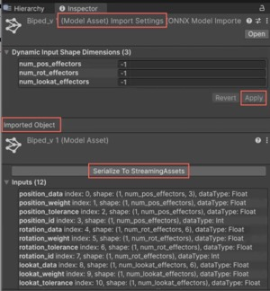

# Model Asset Inspector

The **Model Asset Inspector** provides an overview of imported machine learning (ML) models. Use it to view and verify model properties after import, including structure, inputs, outputs, layers, and constants.

The **Inspector** supports all imported models and reflects any changes made to the [import settings](onnx-import-settings.md).

## Imported object settings

After you configure the model's import settings, the **Inspector** displays the updated model properties in the **Imported Object** section.

Use the **Imported Object** settings section to do the following:

- Serialize the model to the `StreamingAssets` folder.
- Check the properties of an imported and optimized model.

The **Imported Object** section provides a structured view of an imported model, including [inputs](#inputs), [outputs](#outputs), [layers](#layers), and [constants](#constants).

### Inputs

The **Input** section displays a list of model input tensors and their dimensions. The following table details the properties of each input.

|Property|Description|
|-|-|
|**name**|The name of the input, such as `images` or `attention_mask`.|
|**index**|The index of the input.|
|**shape**|The tensor shape of the input. A shape consisting only of numbers represents a static-shaped tensor, for example, (`1, 1, 28, 28`) indicates the model only accepts tensors of shape 1 × 1 × 28 × 28. If a dimension is a named string, such as `batch_size` or `sequence_length`, it's dynamic and can vary in size. For more information on dynamic inputs, refer to [Model inputs](models-concept.md#model-inputs). |
|**dataType**|The data type of the input. For example, `Float` or `Int`.|

### Outputs

The **Outputs** section lists the model’s output tensors. The following table details the properties of each output.

|Property|Description|
|-|-|
|**name**|The name of the output.|
|**index**|The index of the output.|
|**shape**|The tensor shape of the output. Inference Engine tries to precalculate this shape from the model. If a dimension in the shape is a question mark (**?**), Inference Engine can't calculate the size of the dimension, or the size depends on the input (a dynamic output). If the entire tensor shape is **Unknown**, Inference Engine can't calculate the number of dimensions, or the number of dimensions is dynamic. |
|**dataType**|The data type of the output.|

### Layers

The **Layers** section displays all layers in the model and the order in which Inference Engine executes them. The following table details the properties of each layer.

|Property|Description|
|-|-|
|**type**|The type of layer. Refer to [Supported ONNX operators](supported-operators.md) for more information.|
|**index**|The index of the layer.|
|**inputs**|The names of the inputs to the layer. Possible values are a model input from the **Inputs** section, another layer, or a constant.|
|**properties**|The properties of the layer. The properties will depend on the type of layer. Refer to [Supported ONNX operators](supported-operators.md) for more information.|

### Constants

The **Constants** section lists fixed values used in the model. The following table shows the total number of constants and weights in the model, along with a detailed list of constants.

|Property|Description|
|-|-|
|**type**|The type is always **Constant**.|
|**index**|The index of the constant.|
|**weights**|The tensor shape of the constant. If the tensor shape is empty - **()** - the constant is a scalar (a zero-dimensional tensor).|

## Import and update ONNX model settings

Use the **Model Asset Import Settings** section in the **Inspector** to configure dynamic input shape dimensions before Unity processes the ONNX model.

When you update a dynamic input value, such as setting `batch_size` from `-1` (dynamic) to a static number like `4`, and select **Apply**, Inference Engine re-imports the model with the updated configuration. These changes are reflected in the **Imported Object** > section, where both the **Inputs** list and the total number of **Layers** will update based on the modified input dimensions.

> [!NOTE]
> When you modify an input dimension in an ONNX model and select **Apply** > **Serialize To StreamingAssets**, Inference Engine preserves the updated values when serializing the model to a `.sentis` file. The serialized model retains the optimized configuration and doesn't revert to its previous dynamic state. However, you can't modify these input dimensions directly in the `.sentis` file after serialization.

## Model information

This section provides metadata about the imported model, including:

* **Total weight size**: Displays the total size of the model constants.
* **Producer Name**: Displays the source of the model. This might be the producer name and version from the ONNX model or `Script` if Inference Engine generated the model.

## Additional resources

- [Import a model](import-a-model-file.md)
- [Import settings for ONNX models](onnx-import-settings.md)
- [How Inference Engine optimizes a model](models-concept.md#how-inference-engine-optimizes-a-model)
- [Supported ONNX operators](supported-operators.md)