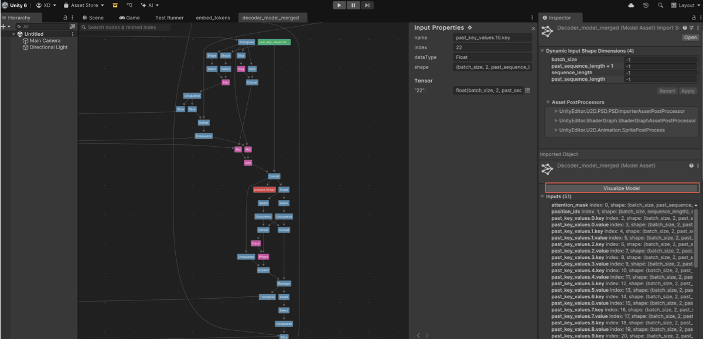

# Inspect models with the Model Visualizer

Use the Model Visualizer to explore the internal structure of your machine learning (ML) model as a node-based graph inside the Unity Editor. It inspects how the model was optimized after import and helps you understand the flow of data and operations throughout the graph.

With the Model Visualizer, you can:

* Check how Sentis transforms your model during import, so you can inspect the actual structure that will run in your application.
* Get a visual, node-based view of your model’s structure to understand complex architectures.
* Trace data flow and tensor connectivity to debug issues, such as shape mismatches, disconnected layers, or unexpected operations.
* Examine inputs, outputs, and constant tensors to understand what data the model consumes and how it's processed.
* Detect issues, such as redundant outputs, missing connections, or unusual runtime behavior before running the model.

> [!NOTE]
> Model Visualizer is read-only. You can inspect models but not edit them.

To use inspect your model with the Model Visualizer, follow these steps:

1. To open the Model Visualizer, do one of the following:

   * In the **Project** window, double-click a **ModelAsset**.
   * In the **Inspector**, select a **ModelAsset**, then select **Visualize Model**.

   

1. Use mouse or touchpad controls to pan, zoom, and move around the graph.

   > [!NOTE]
   > Press **F** at any time to reframe the view around the first node in the graph.

   For details on available navigation shortcuts, refer to [Control scheme shortcuts](#control-scheme-shortcuts).

1. Select a node (represents a model layer, input, or output) or an edge (represents a tensor) to inspect it.

   The selected element is highlighted and shown in the **Properties** panel. This panel shows detailed information about:

   * Inputs, outputs, and constants.
   * Data type, shape, and index.
   * Which layers use a particular value or output.

   Edges in the graph represent tensors, which are the data produced by one operation (layer) and used as inputs to others. A single tensor might be used as input to multiple downstream layers. In these cases, the Model Visualizer displays multiple arrows from one node to indicate shared usage.

   > [!NOTE]
   > Constant tensors don’t appear in the graph view, but appear on the **Properties** panel if they’re used by any nodes. These values are set at import time and don’t change at runtime.

1. To find specific nodes or tensors, open the search bar. Press (macOS: **Cmd**+**F**) or select the search icon in the Model Visualizer window.
1. Enter a layer name or index. You can search for node names and indexes associated with inputs or outputs. The matching nodes are highlighted in the graph.

## Control scheme shortcuts

The Model Visualizer supports two interaction modes: **Modern** (default) and **Editor**. You can change the active control scheme in **Project Settings > Sentis > Model Visualizer**.

| Action | Shortcut for Editor scheme | Shortcut for Modern scheme |
| ------ | -------------------------- | ------------------ |
| Pan | **Alt** (macOS: **Option**) + left mouse button | **Space** + left mouse button |
| Pan (alternative) | Middle mouse button | Middle mouse button |
| Pan (trackpad) |  | Swipe gesture |
| Zoom | Mouse or trackpad scroll | **Ctrl** (macOS: **Cmd**) + mouse scroll |
| Zoom (trackpad) |   | Pinch gesture |
| Zoom (incremental) | **Ctrl** (macOS: **Cmd**) + **+** or **–** | **Ctrl** (macOS: **Cmd**) + **+** or **–** |
| Reset zoom | **Ctrl** (macOS: **Cmd**) + **0** | **Ctrl** (macOS: **Cmd**) + **0** |

> [!NOTE]
> These shortcuts apply only within the Model Visualizer and persist across all sessions in your project.

## Understand node types

Each node in the graph represents one of the following:

| Node type | Description |
| --------- | ----------- |
| Input | A tensor provided by the user to the model at runtime. |
| Output | A tensor produced by the model as the final result. |
| Layer | A model operation that transforms input tensors into output tensors. |

Additionally, some layers produce multiple distinct output tensors, each shown as a separate edge in the graph.

## Properties panel

The **Properties** panel displays context-specific information based on what you select in the graph.

When you select a **node** (layer, input, or output), the panel shows the following information:

* Node type
* Shape and data type
* Operation-specific attributes
* Index and name
* For constants: value preview (if available)

When you select an **edge** (tensor), the panel shows the following information:

* Tensor shape, data type, index, and name
* References to all layers that use the tensor as an input

Use the navigation buttons in the **Properties** panel to move between related nodes and edges, or return to the previous selections.

## Control scheme settings

To configure how you interact with the Model Visualizer, go to **Project Settings** > **Sentis** > **Model Visualizer**.

On the **Model Visualizer Settings** page, the **Canvas Control Scheme** has the following two options:

| Mode | Description |
| ---- | ----------- |
| Modern (default) | Uses a control scheme similar to Figma or Sketch. |
| Editor | Matches the Unity Shader Graph interaction model. |

If you change the control scheme, it updates all the current and future Model Visualizer windows.

## Additional resources

- [Get output from a model](get-the-output.md)
- [Create and modify tensors](do-basic-tensor-operations.md)
- [Importing models into Unity](https://docs.unity3d.com/6000.2/Documentation/Manual/models-importing.html)
